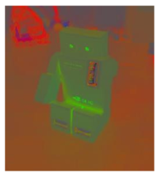

# TP1

## Parte 1 (imágenes en `/white_patch` y `/coord_cromaticas`):

1. Implementar el algoritmo de pasaje a coordenadas cromáticas para librarnos de las variaciones de contraste.
2. Implementar el algoritmo White Patch para librarnos de las diferencias de color de iluminación.
3. Mostrar los resultados obtenidos y analizar las posibles fallas (si es que las hay) en el caso de White Patch.

## Parte 2:

1. Para las imágenes `img1_tp.png` y `img2_tp.png`, leerlas con OpenCV en escala de grises y visualizarlas.
2. Elegir el **número** de bins que creas conveniente y graficar su histograma, comparar los histogramas entre sí.  
   Explicar lo que se observa. Si tuvieras que entrenar un modelo de clasificación/detección de imágenes,  
   ¿consideras que puede ser de utilidad tomar como *features* a los histogramas?
3. Para la imagen `segmentacion.png`, analizar el histograma de los canales RGB.  
   Segmentar algunos de los elementos presentes en la imagen (agua, cielo, tierra) y mostrar, aplicando máscaras,  
   las regiones en imágenes separadas.

---

### Resultado esperado:

